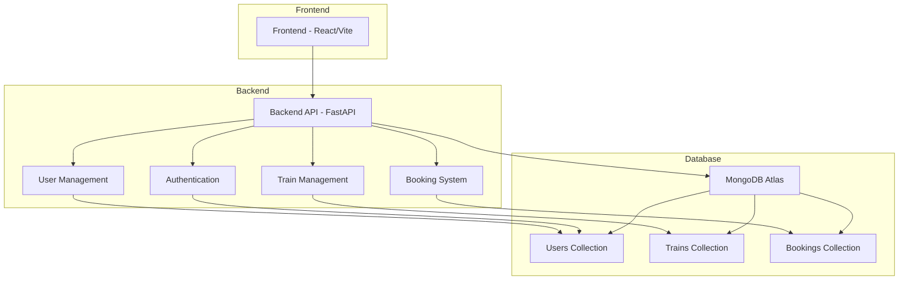

# RailTrack - System Architecture

## Component Overview

### Frontend
- Built with React and Vite
- Uses TypeScript for type safety
- UI components from shadcn/ui
- Responsive design for all device sizes

### Backend
- Built with FastAPI (Python)
- RESTful API design
- JWT-based authentication
- MongoDB integration via PyMongo

### Database
- MongoDB Atlas (cloud database)
- Three main collections:
  - Users: Store user account information
  - Trains: Store train schedule and availability data
  - Bookings: Store booking records

## Data Flow

1. **User Authentication**:
   - User signs up or logs in through the frontend
   - Credentials are sent to the backend authentication service
   - JWT token is generated and returned to the frontend
   - Token is stored in localStorage and sent with subsequent requests

2. **Train Search**:
   - User enters search criteria in the frontend
   - Request is sent to the train management service
   - Service queries the trains collection in MongoDB
   - Results are returned to the frontend for display

3. **Booking Creation**:
   - User selects a train and class
   - Booking request is sent to the booking service
   - Service validates availability and creates booking record
   - Confirmation is returned to the user

## Security Features

- Password hashing with bcrypt
- JWT token-based authentication
- CORS protection
- Input validation with Pydantic models
- MongoDB Atlas security features

## Scalability Considerations

- Stateless backend design allows for horizontal scaling
- MongoDB Atlas provides automatic scaling options
- Caching can be implemented for frequently accessed data
- Load balancing can be added for high-traffic scenarios